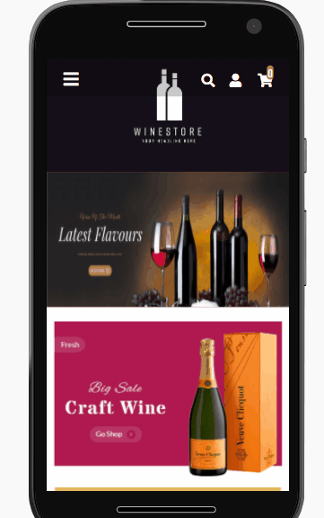

# Wine Store

  

Wine store is a complete and responsive front-end solution in React for ecommerces in the wine departament.

## Usage

After you clone this repo to your desktop, go to its root directory and run <code>npm install</code> to install its dependencies.

Once the dependencies are installed, you can run <code>npm start</code> to start the application. You will then be able to access it at localhost:3000